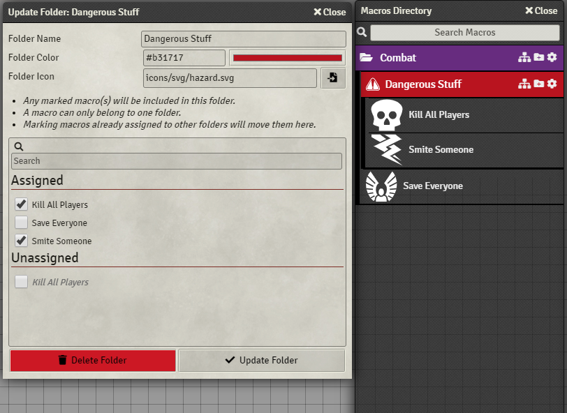

# Macro Folders
     

This is a module for FoundryVTT which allows you to manage macros a bit easier by implementing a folder system.

## Instructions
If you have used my other module Compendium Folders, you will be familiar with how this module works.

#### When you first run the module, it will place all macros into one big folder called "Macros"
Create a folder using the buttom at the bottom and start assigning macros to it.

Each folder has 3 icons. Starting from the right
- The Gear icon allows you to edit the macros inside a folder. They are grouped by Assigned (already in folders) and Unassigned (not in folders). You can also Delete a folder through this dialog, which will delete all child folders and move all macros within to Unassigned
- The Folder icon allows you to create a folder beneath the current folder. 
- The Folder Tree icon allows you to move a folder to another location, also bringing it's children.

You can also import and export your folder configuration, to share with others or to backup your folder structure. In the Settings tab under Macro Folders you can find an Import/Export dialog. Pasting someone elses Import string into the import box will seamlessly import their folder structure, ignoring any missing macros.

I would recommend once you are happy with your layout, to save your folder configuration. This will also be useful if you are going to submit an issue or bug on GitHub.

## Future

1. ~~Default folder for new macros to be added to~~
2. ~~Default Player folders (macros authored by the same person)~~
3. Custom folder ordering (currently defaults to alphabetical)
4. Player-specific folder configurations
5. Show + filter by permissions in edit dialog

Any issues feel free to ping me on Discord (@Erceron#0370)

## Contribution
If you'd like to support my work, feel free to buy me a coffee at [my kofi](https://ko-fi.com/erceron)
